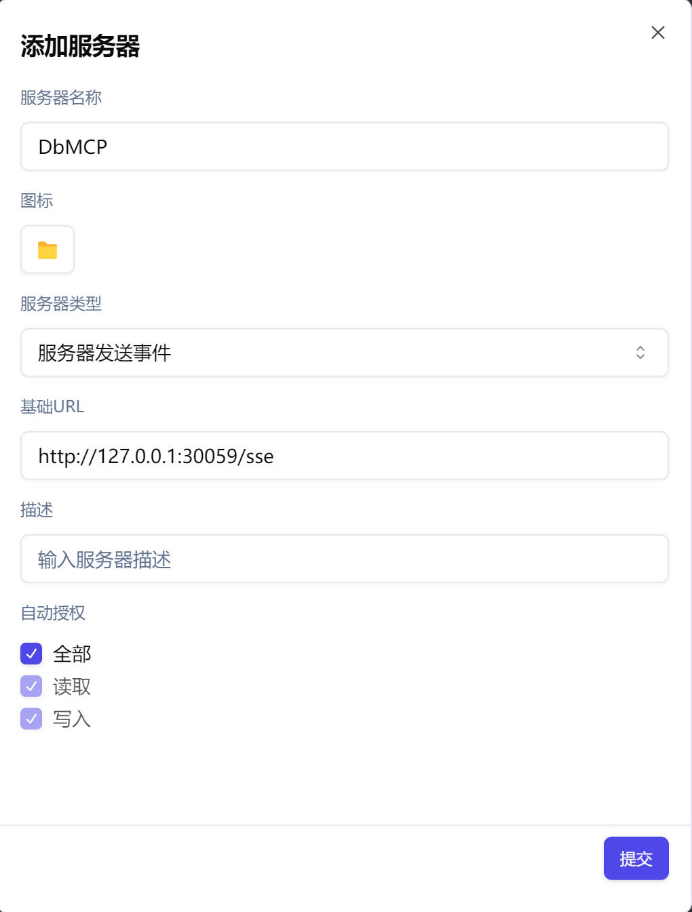
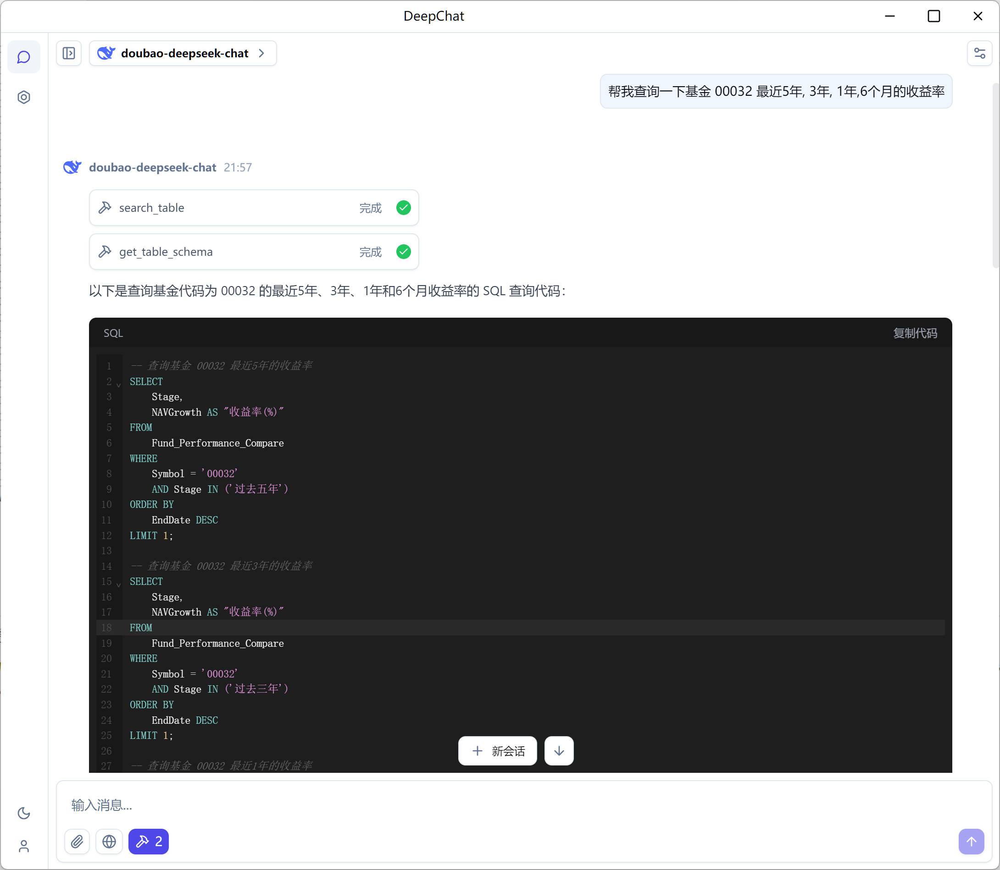
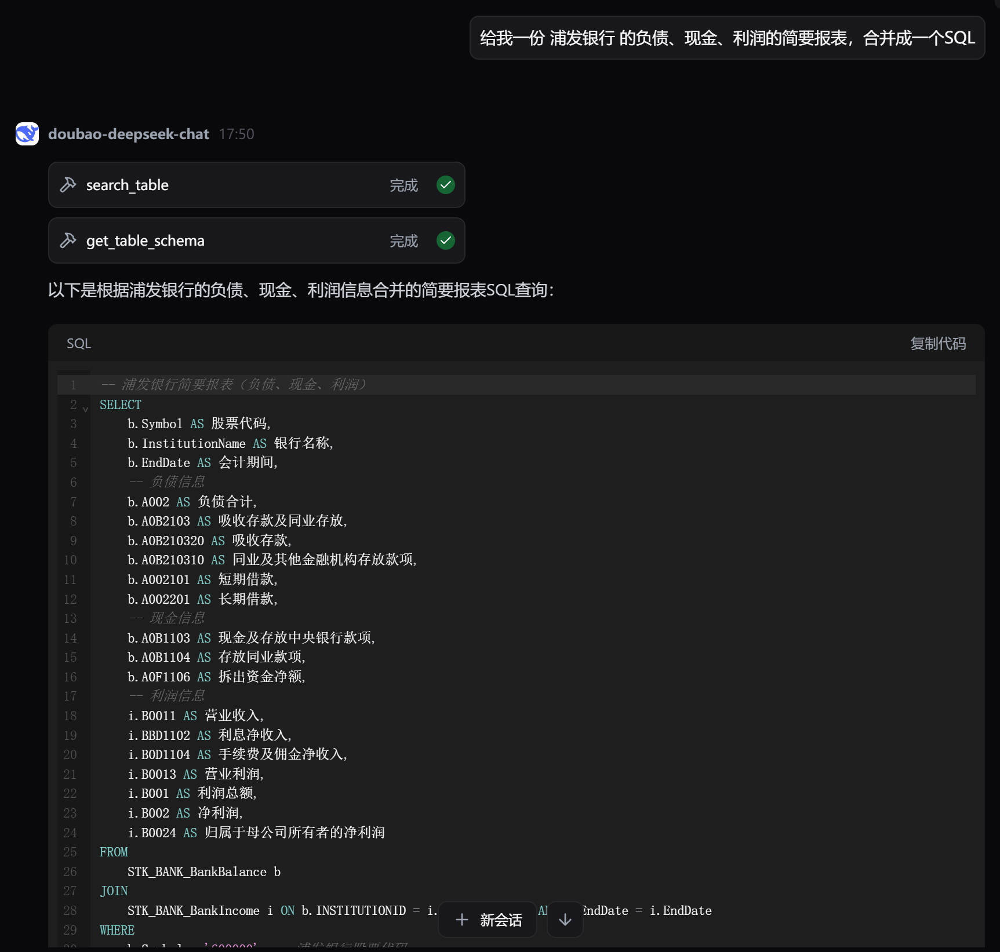

通过MCP让DeepSeek来帮你查询你的大型数据库

# 前言

有时候, 你会面对一个大型的数据库，它可能有数千张表，当你需要进行查询数据时，你需要阅读这些表的结构和数据，了解它们之间的关系。但这个过程是非常繁琐的，特别是你可能并不是一个专业的数据库专家，而是数据的使用者。

在这种情况下，DeepSeek等大模型可以帮助你来编写SQL查询语句，你通过自然语言描述你想要查询的数据，DeepSeek非常擅长编写相应的SQL语句。

但是，要让DeepSeek来帮助你，你需要提供给它足够的信息，包括表名，字段名，数据类型，表之间的关系等等，当你表比较少时，你可以手动一次将这些信息提供给DeepSeek，尽管会多占用一些 Token，但它至少是可行的。

不过，当你的表有数千张时，你就需要考虑如何将这些信息提供给DeepSeek了，因为这些信息的量是非常庞大的，大模型没法一次性处理这么多的信息。以某金融数据库为例，它大概有2300+张表，所有的元数据大概有40+MB，这远远超过了大模型的上下文长度限制。即便在将来, 大模型有可能会有更大的上下文长度限制，但在这个时候，每次请求耗费数百万Token, 成本从数元到数十元, 这个也是不可接受的。

所以, 我们需要一个方法来将这些信息提供给DeepSeek, 让它来帮助我们查询数据。我们可以使用MCP（Model Context Protocol）来实现这个目标。MCP是一种让大模型与外部数据源进行交互的协议，它可以让大模型在查询数据时，自动从外部数据源中获取所需的信息.

我们将提供一个MCP的实现，它提供了两个工具(Tool)

- search_table: 根据用户的输入，让大模型来查找可能需要的表名
- get_table_schema: 根据表名，获取表的结构信息，包括字段名，数据类型，表之间的关系等等

下面, 我们将介绍如何使用MCP来实现这个目标。

# MCP的实现

## 前置

在使用编写这个MCP之前，我们需要先准备数据的元数据, 这包括表名、字段名、数据类型等信息，这些信息一般有两种途径获取

- 直接读取数据库的元数据: 所有的数据库都提供了获取元数据的接口, 你可以直接读取数据库的元数据, 这也是最常用的方法, 但这种方法有一个问题,尽管理想情况下, 数据库的元数据是有良好的命名和注释, 但在实际应用中，这一点很难达到, 特别是当你面对的是一个国内的数据库时, 你会发现很多非常规的命名, 这些会困扰大模型, 同时, 注释也总是缺失的.
- 通过文档或数据字典: 一般来说, 文档中会包含关于数据库结构的详细信息，包括表的描述、字段的含义等，这些信息可以帮助大模型更好地理解数据的上下文。但你需要从这些文档中提取出这些信息, 这也是一个非常繁琐的工作, 但相对来说, 这种方法是比较可靠的, 从实践来看, 这远比直接读取数据库的元数据要好, 你可能需要一个特定的工具来提取这些信息.

当你准备好了这些信息后, 你就可以开始编写MCP了.

## MCP的实现

我们将使用Python来实现这个MCP, 但你可以使用任何你喜欢的编程语言来实现这个MCP.

```python

import io
import json

from mcp.server.fastmcp import FastMCP

mcp = FastMCP("DemoDB", port="30059")


def load_tables() -> dict[int, any]:
  with open("doc/demo.jsonl", "r", encoding="utf-8") as f:
    tables = {}
    for line in f:
      table = json.loads(line)
      tables[table["id"]] = table
    return tables


ALL_TABLES = load_tables()


@mcp.tool()
def search_table(keyword: list[str]) -> str:
  """
  Search table by keyword.
  """
  table = [
    "id  | name",
    "--- | ---",
  ]
  with open("doc/demo_table.md", "r", encoding="utf-8") as f:
    for line in f:
      for kw in keyword:
        if kw in line:
          table.append(line.strip())

  if len(table) == 2:
    return "No table found."

  return "\n".join(table)


def format_table(table: dict) -> str:
  """
  Format the table to markdown.
  """
  buf = io.StringIO()
  buf.write(f"# 表名: {table['name']} 中文名: {table['cn_name']}\n")
  buf.write("## 字段列表\n")

  buf.write("| 字段名 | 中文名 | 类型 | 说明 |\n")
  buf.write("| --- | --- | --- | --- |\n")
  for col in table["columns"]:
    buf.write(f"| {col['name']} | {col['cn_name']} | {col['type']} | {col['desc']} |\n")
  buf.write("\n")

  return buf.getvalue()


@mcp.tool()
def get_table_schema(ids: list[int]) -> str:
  """
  Get the schema of the tables by ID.
  """

  if len(ids) == 0:
    return ""
  buf = io.StringIO()
  for id in ids:
    table = ALL_TABLES.get(id, None)
    if table is not None:
      buf.write(format_table(table))
  return buf.getvalue()


if __name__ == "__main__":
  mcp.run("sse")
```

# MCP的使用

## 选择客户端

我们需要一个支持MCP的客户端来使用这个MCP, 例如

- DeepChat : https://github.com/ThinkInAIXYZ/deepchat
- CherryStudio : https://github.com/CherryHQ/cherry-studio
- Claude Desktop: https://claude.ai/download

其中, Claude Desktop 仅支持它自家的大模型, 而其他的两个开源的客户端都支持多种大模型, 你可以根据自己的需求来选择.

我们以DeepChat为例, 来介绍如何使用这个MCP.

首先, 启动MCP, 你可以在终端中运行以下命令

```bash
python3 db_mcp.py
```

然后, 在DeepChat中, 配置你的连接设置以便与MCP进行通信。




在配置完成后, 你就可以使用MCP了

## 案例1 根据用户的需要，从2300+表中找到最合适的表并编写SQL



在这个示例中, DeepSeek 根据我们的输入, 自动的找到了 `Fund_Performance_Compare` 这个表, 然后获取了这个表的结构信息, 用需要的字段来生成了SQL查询语句.

## 案例2 多表的JOIN

在这个案例中，还是同样的数据库，我们的要求模型 `给我一份 浦发银行 的负债、现金、利润的简要报表，合并成一个SQL`

模型找到了相关的多个表，然后编写了相应的SQL

